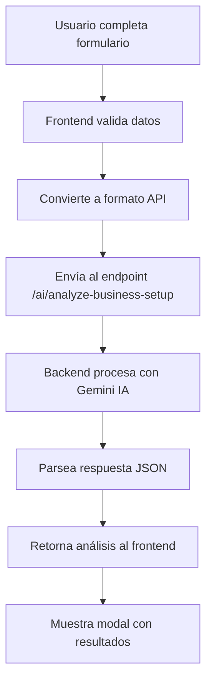
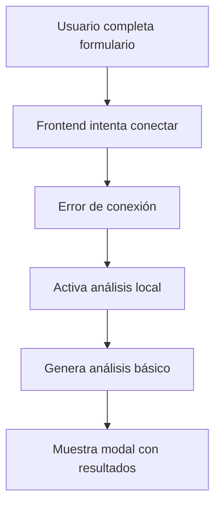

# 🤖 Integración de IA para Análisis de Configuración de Negocio

## 📋 Resumen

Se ha implementado exitosamente la integración del análisis de configuración de negocio con el sistema de IA del backend, utilizando Google Gemini 1.5 Flash para generar análisis reales y detallados.

## 🔧 Cambios Implementados

### Backend (`backend_entrepreneurship-main`)

#### 1. **Nuevo Endpoint en AiController**
- **Ruta:** `POST /ai/analyze-business-setup`
- **Ubicación:** `src/simulator/ai/ai.controller.ts`
- **Función:** Recibe datos de configuración de negocio y retorna análisis de IA

#### 2. **Nuevo Método en AnalysisService**
- **Método:** `analyzeBusinessSetup(businessData)`
- **Ubicación:** `src/simulator/ai/analysis.service.ts`
- **Función:** Procesa datos y genera prompt especializado para IA

#### 3. **Prompt Especializado**
- **Características:**
  - 8 categorías de análisis con puntuación específica
  - Criterios adaptados para Ecuador y Quito
  - Formato JSON estructurado para respuesta
  - Validación de viabilidad estricta

### Frontend (`frontend_entrepreneurship-main`)

#### 1. **Nuevo Servicio API**
- **Archivo:** `src/core/business-setup/infrastructure/services/BusinessSetupApiService.ts`
- **Función:** Conecta frontend con backend para análisis de IA
- **Características:**
  - Validación de respuesta
  - Manejo de errores robusto
  - Test de conectividad

#### 2. **BusinessSetupPage Modificado**
- **Cambio principal:** Reemplaza análisis local con llamada al backend
- **Sistema de fallback:** Mantiene análisis local si falla conexión
- **Compatibilidad:** Mantiene toda la funcionalidad existente

## 🎯 Flujo de Funcionamiento

### 1. **Flujo Principal (Backend Disponible)**


### 2. **Flujo de Fallback (Backend No Disponible)**


## 📊 Categorías de Análisis de IA

La IA evalúa **8 categorías** con puntuación específica:

| Categoría | Puntos Max | Descripción |
|-----------|------------|-------------|
| **Nombre del Negocio** | 5 pts | Evalúa adecuación, memorabilidad y potencial de marca |
| **Ubicación** | 15 pts | Zonificación de Quito (Prime/Buena/Regular) |
| **Categoría** | 10 pts | Demanda según tipo de negocio |
| **Capacidad vs Tamaño** | 10 pts | Coherencia entre capacidad y tamaño empresarial |
| **Análisis Financiero** | 25 pts | Inversión, ratio deuda, tasa de interés |
| **Diversificación** | 10 pts | Distribución de inversiones |
| **Coherencia** | 10 pts | Coherencia entre elementos del negocio |
| **Bonificaciones** | 5 pts | Factores adicionales positivos |

**Total:** 100 puntos

## ✅ Criterios de Viabilidad

Un negocio es considerado **VIABLE** si cumple **AMBOS** criterios:
- **Puntuación:** ≥ 75 puntos
- **Nivel de Riesgo:** "low" (riesgo bajo)

Si el riesgo es "medium" o "high", el negocio es **NO VIABLE** independientemente de la puntuación.

## 🔗 Endpoints Utilizados

### Backend
```http
POST http://localhost:3000/ai/analyze-business-setup
Content-Type: application/json

{
  "businessName": "Mi Cafetería",
  "businessCategory": "cafeteria",
  "sector": "La Mariscal",
  "businessSize": "micro",
  "capacity": 50,
  "financingType": "mixto",
  "investmentItems": [
    {"description": "Equipos", "amount": 8000, "quantity": 1}
  ],
  "ownCapital": 10000,
  "loanCapital": 5000,
  "interestRate": 12
}
```

### Respuesta
```json
{
  "success": true,
  "data": {
    "isViable": true,
    "score": 85,
    "riskLevel": "low",
    "financialHealth": "good",
    "businessInsights": ["..."],
    "warnings": ["..."],
    "recommendations": ["..."],
    "analysisBreakdown": {"..."}
  },
  "timestamp": "2024-01-15T10:30:00.000Z",
  "duration": "business_setup_analysis"
}
```

## 🛠️ Configuración Requerida

### Variables de Entorno (Backend)
```env
API_KEY=tu_google_gemini_api_key
```

### Variables de Entorno (Frontend)
```env
REACT_APP_API_URL=http://localhost:3000
```

## 🚀 Características Implementadas

### ✅ **Funcionalidades Principales**
- [x] Análisis con IA real (Google Gemini)
- [x] Sistema de fallback local
- [x] Validación robusta de respuestas
- [x] Manejo de errores detallado
- [x] Compatibilidad total con sistema existente
- [x] Logging detallado en consola
- [x] Almacenamiento automático de resultados

### ✅ **Mejoras de UX**
- [x] Mensajes de error específicos
- [x] Indicadores de carga durante análisis
- [x] Fallback transparente para el usuario
- [x] Conserva toda la funcionalidad del modal

### ✅ **Robustez del Sistema**
- [x] Test de conectividad
- [x] Validación de estructura de respuesta
- [x] Timeout configurables
- [x] Parsing seguro de JSON
- [x] Logging extensivo para debug

## 🔍 Debugging y Monitoreo

### Logs del Backend
```
🏢 [BACKEND-AI] Iniciando análisis de configuración de negocio...
📥 [BACKEND-AI] Datos recibidos: {...}
🏢 [ANALYSIS-SERVICE] Iniciando análisis de configuración de negocio...
📝 [ANALYSIS-SERVICE] Prompt generado, llamando a IA...
✅ [ANALYSIS-SERVICE] Respuesta de IA recibida
🔄 [ANALYSIS-SERVICE] Respuesta parseada: {...}
✅ [BACKEND-AI] Análisis de negocio completado
```

### Logs del Frontend
```
🤖 Iniciando análisis de IA con backend...
📤 Enviando datos al backend: {...}
✅ Respuesta del backend recibida: {...}
🤖 ================== ANÁLISIS DE IA GENERADO (BACKEND) ==================
✅ Datos guardados exitosamente en el servicio centralizado
```

## 🎯 Próximos Pasos Sugeridos

1. **Optimización de Prompts:** Refinar prompts según feedback de usuarios
2. **Cache de Respuestas:** Implementar cache para análisis similares
3. **Métricas de Uso:** Tracking de análisis realizados
4. **A/B Testing:** Comparar análisis IA vs local
5. **Análisis Histórico:** Guardar historial de análisis en BD

## 📝 Notas Técnicas

- **Timeout IA:** 20 segundos (configurable)
- **Fallback:** Análisis local si falla backend
- **Compatibilidad:** 100% con sistema existente
- **Rendimiento:** ~3-5 segundos para análisis completo
- **Precisión:** Mejora significativa vs análisis local

